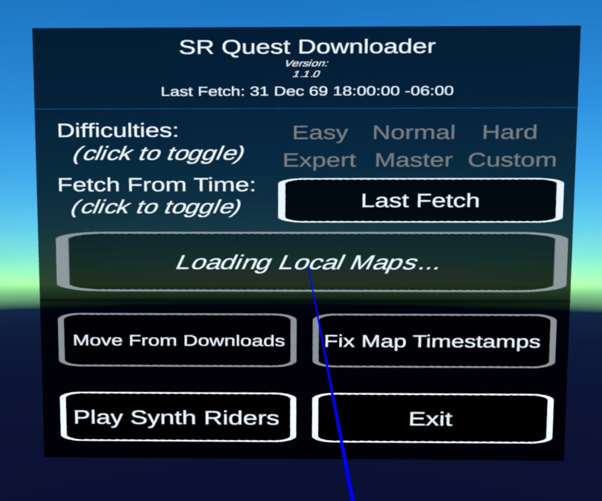

# SRQuestDownloader

This is an Android application for Meta/Quest VR devices for downloading custom content from synthriderz.com.

## Installing
### From SideQuest
2. Install [SideQuest](https://sidequestvr.com/setup-howto). You might need the Advanced Installer; not sure. Advanced Installer will for sure work.
3. You might need to set up your device as a developer device. SideQuest might have info on that, otherwise check out [this guide](https://learn.adafruit.com/sideloading-on-oculus-quest/enable-developer-mode)
4. Plug in your headset to your computer and allow the permissions prompt that comes up.
5. Run SideQuest.
6. Go to the [app page on SideQuest](https://sidequestvr.com/app/12996/srquestdownloader) and hit "Download App (sideload)" to install on your device
7. On your Quest, go to the App Library (seleting all apps). In the upper right open the dropdown and change "All" to "Unknown Sources"
8. Click on SRQuestDownloader to run

### From Releases Tab
1. Download the latest apk from the [Releases](https://github.com/bookdude13/SRQuestDownloader/releases) tab
2. Install [SideQuest](https://sidequestvr.com/setup-howto). You'll need the Advanced Installer until this is stable and released officially.
3. You might need to set up your device as a developer device. SideQuest might have info on that, otherwise check out [this guide](https://learn.adafruit.com/sideloading-on-oculus-quest/enable-developer-mode)
4. Plug in your headset to your computer and allow the permissions prompt that comes up.
5. Run SideQuest and select the icon on the upper right, in the middle of the row with the down arrow. This lets you install APKs onto your Q/Q2.
6. Select the apk you downloaded. This should install onto your device.
7. On your Quest, go to the App Library (seleting all apps). In the upper right open the dropdown and change "All" to "Unknown Sources"
8. Click on SRQuestDownloader to run

Note: The first time this runs it will catalog locally stored custom songs. This can take 1-2 minutes if you have all custom songs downloaded already.

## First Run
SRQuestDownloader requires read and write permissions to the sdcard on the device.

For Quest and Quest 2/Quest Pro running < v51 this is handled through prompts requesting access on the first boot.

For Quest devices running v51+, Android 11 made access to the sdcard stricter. You will need to follow the in-app prompt to allow all sdcard access to the app. Failure to do so will not allow custom content to be read from or saved to the SynthRidersUC folder. For you nerds out there, this is the MANAGE_EXTERNAL_STORAGE permission.

An alternative way to give this permission for v51+ devices is running the following adb command (from SideQuest or directly from a shell):  
`adb shell appops set --uid com.bookdude13.srquestdownloader MANAGE_EXTERNAL_STORAGE allow`

The first time the app runs it will index all custom songs currently on the device and cache this locally. It can take a while; be patient and watch the progress on the left panel. This should only take a long time if you have a lot of songs downloaded and you newly installed or reinstalled the app.

# Features

## Fetch Songs
***NOTE: The first use of this button will take a while!*** It will be sped up tremendously if you already have custom songs on your device. You can use [NoodleManagerX](https://github.com/tommaier123/NoodleManagerX) to efficiently download custom songs en-masse.

This downloads all custom maps/songs from the synthriderz.com site, published after the last time this button was pushed, that aren't present on your device. I'm not sure if this will pick up updated maps, but it should cover most use cases.

It only grabs maps from the selected difficulties (the ones underlined/white). If no difficulties are selected, then the filter is ignored and all difficulties are grabbed.

You can also change the time frame for your fetch. Note, doing a fetch for maps from  _any_ time point will update the Latest Fetch timestamp.

## Move From Downloads
This copies custom maps, stages, and playlists from the Quest Download/ folder to the Synth Riders directories.

1. In your Quest device, open up the Browser app
2. Navigate to synthriderz.com
3. Find maps, stages, and playlists you want and use the "Download" buttons for each of them. For downloading multiple songs/maps, use "Get All" or "Get Page" (this downloads a zip file).
4. Run SRQuestDownloader and select "Move From Downloads" to move and/or extract all necessary files to the matching Synth Riders directories.

## Fix Map Timestamps
This updates the data modified for any local map files to the Z published_at time. This fixes in-game sorting by timestamp. It uses a local mapping first, then tries to fetch all map metadata from synthriderz.com and update that way.

Note - you may need to reimport songs in Synth Riders after applying this fix, to update the in-game database.

## Play Synth Riders
Closes this application and launches the Synth Riders application. I haven't tested what happens if Synth Riders isn't installed, but I doubt that'll be a common problem :P

---
# More Details

## Fetch Latest Songs
This does the following:
- Get all song hashes from the Z site with published_at values after the "last fetch" date
- Get all local song metadata from `/sdcard/SynthRidersUC/CustomSongs` (see below)
- Any song hash from Z that isn't present locally is downloaded, first to a temp directory and then moved to `/sdcard/SynthRidersUC/CustomSongs`
- Any song hash that is local but not on Z is ignored
- Any song hash that is present in both is skipped (assumed to be up to date)

Local song metadata is cached in `/sdcard/Android/data/com.bookdude13.srquestdownloader/files/SRQD_local.db` for faster parsing time on boot.
- The cache is based on file name
- If a file is present locally but not in the cache database, it is parsed and added
- If a file is present in the database but not locally, it is dropped

## Move From Downloads
This does the following:
- Copies maps, stages and playlists from the Quest downloads folder (`/sdcard/Download`) to the corresponding Synth Riders folders (`/sdcard/SynthRidersUC/CustomSongs`, etc), *then deletes the source file*. This is to avoid duplicate copies in consecutive runs.
- Extracts zip files from the Quest downloads folder that end with "synthriderz-beatmaps.zip". Any maps, stages or playlists found in this zip file will be moved to the corresponding Synth Riders folder (under /SynthRidersUC/*). *Then the source zip is deleted*. This is to avoid duplicate copies in consecutive runs.

---
## Development
Feel free to extend this as you want. Open issues for bugs and feature requests, and open PRs if you implement some of those yourself. I will try to respond in a timely manner :)

Logs are output to `/sdcard/Android/data/com.bookdude13.srquestdownloader/files/logs/`. Logs older than 7 days are removed at startup.

This project uses SRTimestampManager to handle fixing timestamps (since that project also has console apps to do the fixing).

The SynthDB is updated as well, using the sqlite-net library (https://github.com/praeclarum/sqlite-net).

---
### Disclaimer
This mod is not affiliated with Synth Riders or Kluge Interactive. Use at your own risk.

